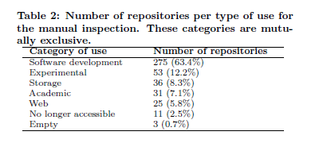

# 论文阅读

## 1.The Promises and Perils of Mining GitHub 

本文主要描述的是在对Github上的仓库代码进行研究时，应该要注意的各种潜在的风险。

#### 文章作者总结的一些需要注意的问题：

- 一个仓库并不一定是一个项目

  - 源代码仓库和fork的代码仓库，新兴的分布式开发使得有多个分支。而对于主仓库的挖掘，容易忽视副仓库的信息。因此，在分析时应全面考虑。

- 大多数项目只有少数的commit

- 大多数项目都不活跃

  - 通过时间戳，考虑最近提交的数量来判断一个代码仓库的“活性”

- 很大一部分仓库不是用于软件开发的

  - 
  - 通过文件类型、内容关键词分析等方法，是一个不错的识别仓库类型的手段

- 三分之二以上的仓库是私人的

- 许多未显示被merge的commit实际上已经被merge了

- 许多软件未开源

#### 两个关于Github仓库挖掘的工具

- GHTorrent 
- Gitminer

## 2.Mining Developer Contribution

本文主要研究如何利用可视化技术挖掘开源软件中开发者的贡献

- 最经典的代码贡献度量方法 LOC 法，第$i$名成员的贡献度被定义为：

  - $$
    Contri(i)=\frac{LOC(i)}{\sum_{k=1}^nLOC(k)}+\frac{Commit(i)}{\sum_{k=1}^nCommit(k)},1\le i \le n
    $$

- 从开发人员第一次Commit代码后研究对开发者质量的影响因子
  - code instability：代码的不稳定性
    - Instability is measured using the number of modifies by others one month before the newcomer’s first commit (HCC)
  - code structure as well as commit features：代码的结构和提交特性
    - FanIn, fanOut, LOC, **number of attributes (NOA)** and **number of methods (NOM)** are used to measure code structure. （FanIn和FanOut？）
    - Commit features include **LOC changed (FCLOC)** and the **number of new files (NFC) in the first commit**. 
  -  time characteristics ：时间特性
    - barcode visualization：可视化条形码
    - 颜色深度表示某一天的提交数目，间隔表示没有提交的时间
    - 

## 3.DATA COLLECTION AND ANALYSIS

本文的目的主要是试图找到结合项目特征和用户特性之间的准则

- 数据收集：通过Github rest API
- 收集的数据：经过筛选后，有用于后续分析的数据有以下13种
  - repository main languages
  - number of forks
  - number of open issues
  - has wiki
  - number of hooks
  - repository age
  - country of the repository user
  - number of public repositories of repository user
  - is hirable
  - number of repository user collaborators
  - number of repository user followers
  - number of repository user followees
- 数据分析
  - 关键词：Apriori算法，weka工具，k-means计算离散特征值，SPSS

