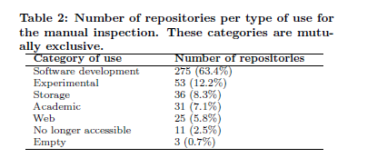

# The Promises and Perils of Mining GitHub 

本文主要描述的是在对Github上的仓库代码进行研究时，应该要注意的各种潜在的风险。

#### 文章作者总结的一些需要注意的问题：

- 一个仓库并不一定是一个项目

  - 源代码仓库和fork的代码仓库，新兴的分布式开发使得有多个分支。而对于主仓库的挖掘，容易忽视副仓库的信息。因此，在分析时应全面考虑。

- 大多数项目只有少数的commit

- 大多数项目都不活跃

  - 通过时间戳，考虑最近提交的数量来判断一个代码仓库的“活性”

- 很大一部分仓库不是用于软件开发的

  - 
  - 通过文件类型、内容关键词分析等方法，是一个不错的识别仓库类型的手段

- 三分之二以上的仓库是私人的

- 许多未显示被merge的commit实际上已经被merge了

- 许多软件未开源

#### 两个关于Github仓库挖掘的工具

- GHTorrent 
- Gitminer

